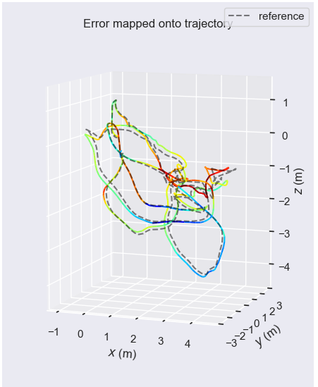
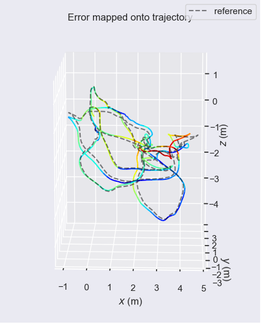
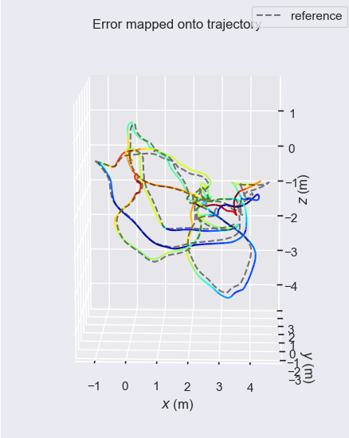

# PL-inertial-slam

## Reference works
1. PL-SLAM `https://github.com/rubengooj/pl-slam.git`
2. VIORB `https://github.com/jingpang/LearnVIORB.git`
3. VINS-MONO `https://github.com/HKUST-Aerial-Robotics/VINS-Mono`
   
Thankyou for their outstanding work. My code is basically copied from them. **The basic framework is from PL-SLAM, the IMU preintegration is from VIORB, the marginalization is from VINS-MONO**

## Required Library
1. g2o
2. OpenCV 3.X.X
3. Eigen3
4. Boost
5. yaml
6. mrpt

 **The library I use is basically the same as PL-slam. Please refer to the main page of PL-slam for more information. But I put StVO-PL directly into the program, so this library does not need to be installed.**

 ## How To Run
 I only test on the Euroc dataset of V1_easy, so I take this dataset as example.
 
 0. Set the variable `DAFAULT_USE_MARG` in the `cmakelists.txt` to choose if use marginalization in the localmapping thread
 1. Use scripts `./build.sh` to compile programs
 2. Put the `dataset_params.yaml` under the `config/dataset_params` directory into the dataset `V1_easy` root directory
 3. Unzip `voc.tar.gz` under the `vocabulary` directory
 4. Change value of `vocabulary_p` and `vocabulary_l` in the file of `config_euroc.yaml` under the `config/config` directory
 5. Set dataset environment variables and run program. For example, my dataset `V1_easy` is in the directory `/home/xc/Euroc/V1_easy`, Run the program with the following command:

    1. `export DATASETS_DIR=/home/xc`
    2. `cd build`
    3. `./plslam_dataset Euroc/V1_easy -c ../config/config/config_euroc.yaml`

# Result

## Compare with the origin PL-SLAM
 All results are compared with ground truth using the tool of EVO.

 The left picture is the result of **pl-slam with IMU and marginalization**.

 The mid picture is the result of **pl-slam with IMU but no marginalization**.

 The right picture is the result of original **pl-slam**.

# Remarks
1. The program may have bugs like (segment fault), if you happen to meet it, just run program again.

2. This is just the code that I used to learn vio. If there is any mistake, please forgive me