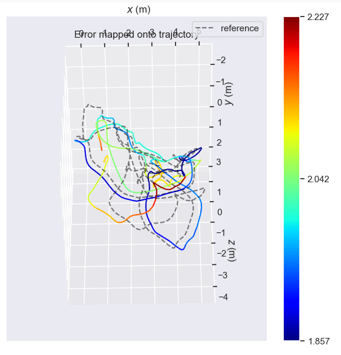
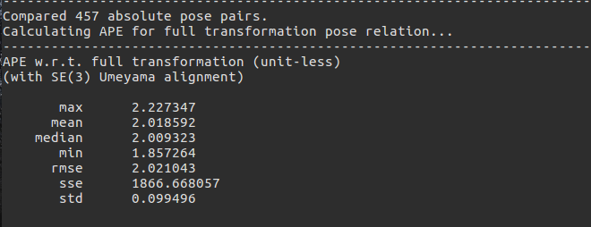
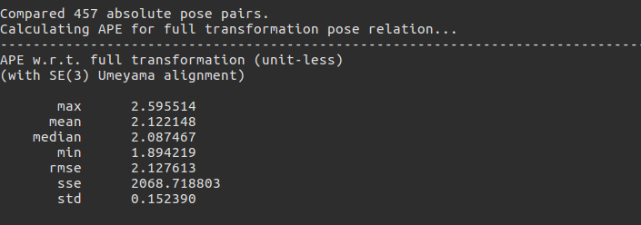

# PL-VIO

## Reference works
1. PL-SLAM `https://github.com/rubengooj/pl-slam.git`
2. VIORB `https://github.com/jingpang/LearnVIORB.git`

Thankyou for their outstanding work. My code is basically copied from them

## Required Library
1. g2o
2. OpenCV 3.X.X
3. Eigen3
4. Boost
5. yaml
6. mrpt

 **The library I use is basically the same as PL-slam. Please refer to the main page of PL-slam for more information. But I put StVO-PL directly into the program, so this library does not need to be installed.**

 ## How To Run
 I only test on the Euroc dataset of V1_easy, so I take this dataset as example.

 1. Use scripts `./build.sh` to compile programs
 2. Put the `dataset_params.yaml` under the `config/dataset_params` directory into the dataset `V1_easy` root directory
 3. Unzip `voc.tar.gz` under the `vocabulary` directory
 4. Change value of `vocabulary_p` and `vocabulary_l` in the file of `config_euroc.yaml` under the `config/config` directory
 5. Set dataset environment variables and run program. For example, my dataset `V1_easy` is in the directory `/home/xc/Euroc/V1_easy`, Run the program with the following command:

    1. `export DATASETS_DIR=/home/xc`
    2. `cd build`
    3. `./plslam_dataset Euroc/V1_easy -c ../config/config/config_euroc.yaml`

# Result

## Compare with the origin PL-SLAM
 Both result is compared with ground truth using the tool of EVO, Above diagram is the result of PL-VIO and the below is PL-SLAM, ***both programs turn off the LoopClosing detection module***

# Remarks
1. There is no guarantee that the program will crash or run incorrectly after the ***LoopClosing*** detection module is opened

2. This is just the code that I used to learn vio. If there is any mistake, please forgive me